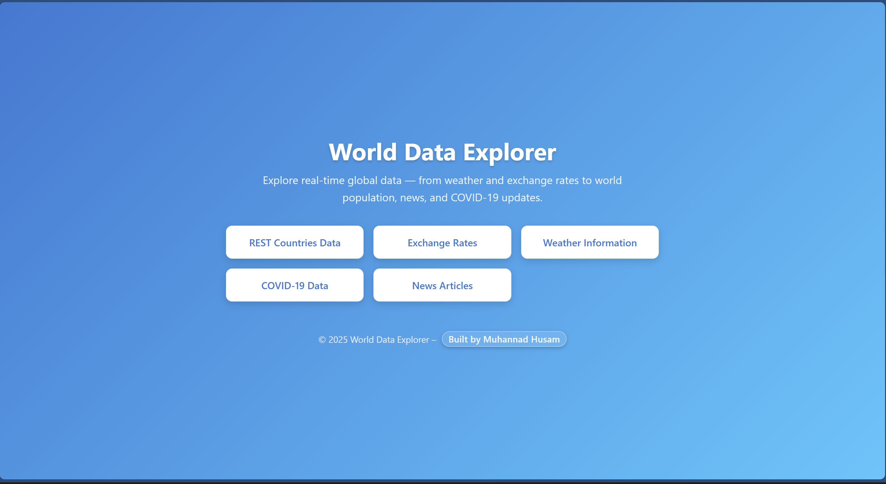
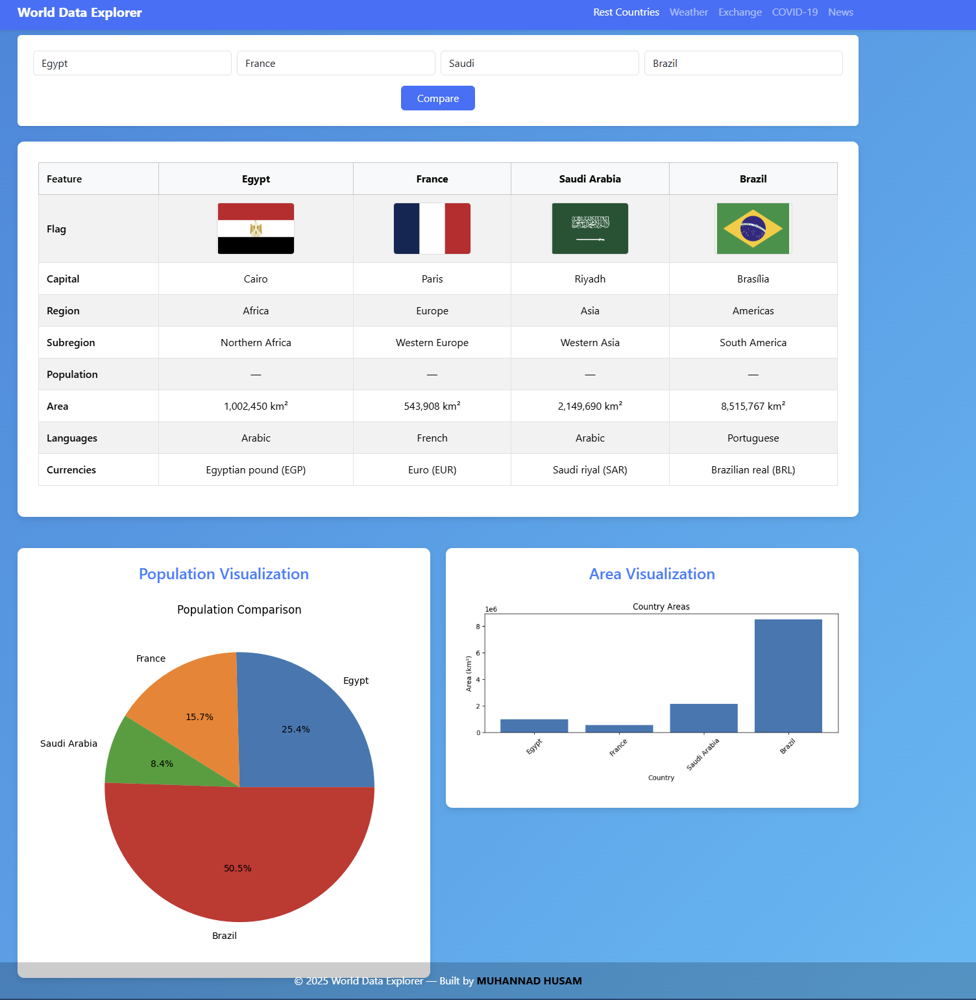
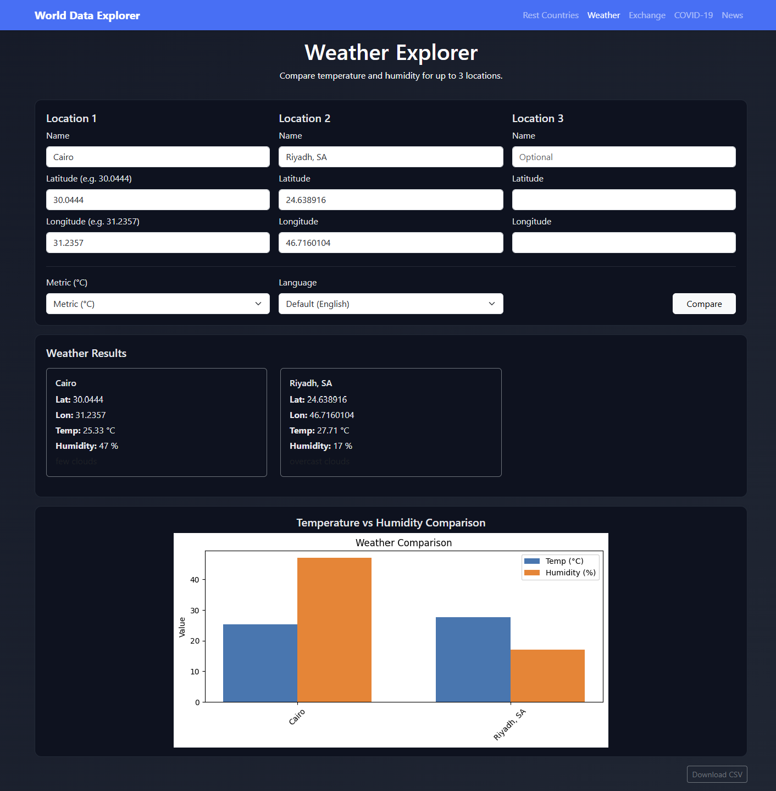
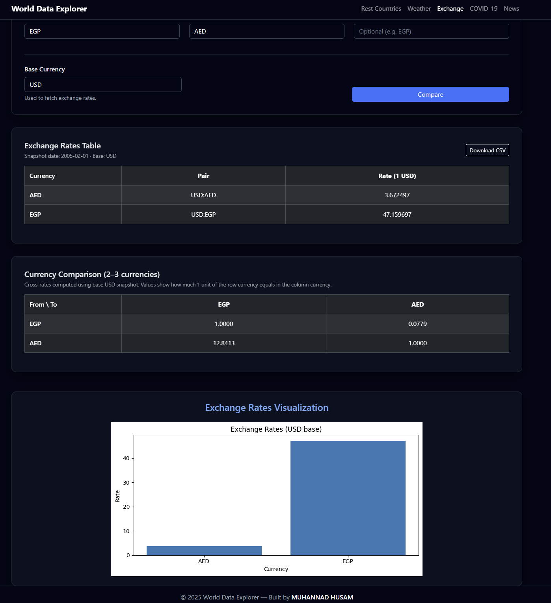
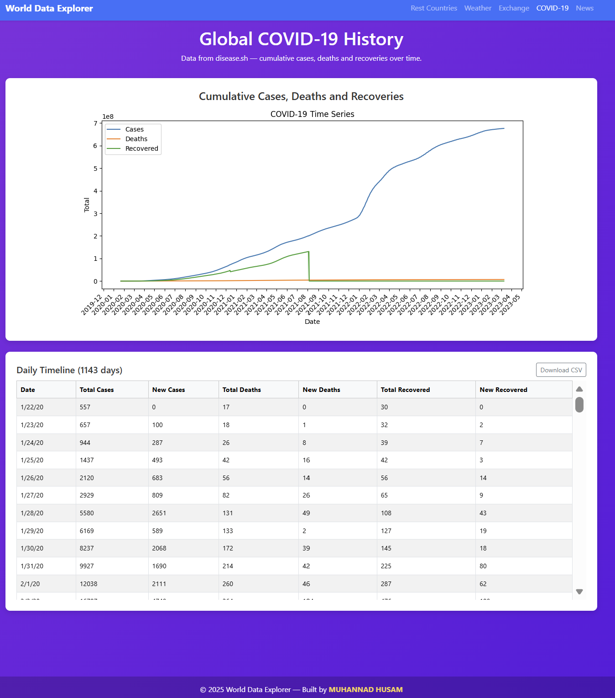
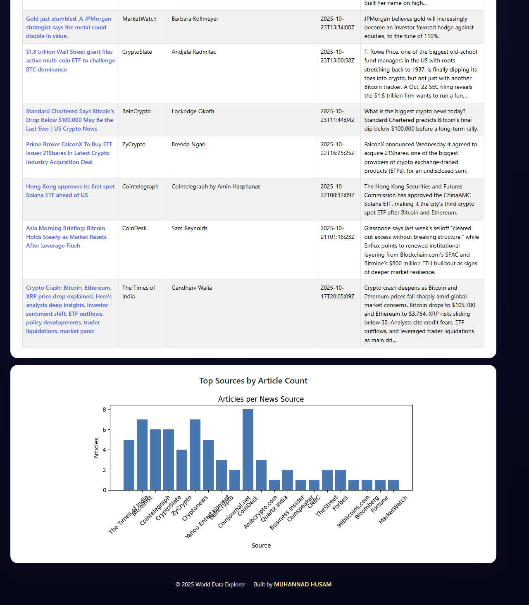

# World Data Explorer

World Data Explorer is a small Flask web app that lets you play with **real-world live data**:

- Global **COVID-19** time-series  
- **Foreign exchange** rates  
- **News** for any topic  
- **Country** information (population, area, currencies…)  
- **Weather** for any location  

---

## 1. How to Open the Project

### 1.1 Windows

- Open **File Explorer** and navigate to the unzipped `World-Data-Explorer` folder.  
- Click the **address bar**, type:

  ```text
  cmd
  ```

  then press **Enter**.  

- A Command Prompt window will open **inside the project folder**.

### 1.2 macOS / Linux

- Open **Terminal**.  
- Navigate to the project folder, for example:

  ```bash
  cd ~/Downloads/World-Data-Explorer
  ```

---

## 2. Create and Activate a Virtual Environment

Using a virtual environment keeps this project’s packages isolated from your global Python installation.

### 2.1 Create the virtual environment

From inside the `World-Data-Explorer` folder, run:

```bash
python -m venv .venv
```

If `python` doesn’t work, try:

```bash
python3 -m venv .venv
```

This will create a folder named `.venv` inside the project.

### 2.2 Activate the virtual environment

**Windows (Command Prompt / PowerShell)**

```bash
.venv\Scriptsctivate
```

**macOS / Linux (bash / zsh)**

```bash
source .venv/bin/activate
```

You should now see something like `(.venv)` at the beginning of your terminal prompt.

To **deactivate** later, run:

```bash
deactivate
```

---

## 3. Install Dependencies

With the virtual environment **activated**, install the required packages:

```bash
pip install -r requirements.txt
```

If `pip` is not found, use:

```bash
python -m pip install -r requirements.txt
# or
python3 -m pip install -r requirements.txt
```

This will install **Flask**, **requests**, **matplotlib**, and all other dependencies.

---

## 4. How to Run the Project

1. Open a terminal in the `World-Data-Explorer` folder.  
2. Activate your virtual environment (see section **2.2**).  
3. Run the Flask app using `run.py`:

   ```bash
   python run.py
   ```

   If needed:

   ```bash
   python3 run.py
   ```

You should see something like:

```text
 * Running on http://127.0.0.1:5000/ (Press CTRL+C to quit)
```

Open your browser and go to:

```text
http://127.0.0.1:5000/
```

You should see the **World Data Explorer** home page.

---

## 5. Stopping the App

To stop the development server, in the same terminal press:

```text
CTRL + C
```

If you used a virtual environment and want to exit it:

```bash
deactivate
```

---

## 6. Tech Stack

- **Backend:** Python 3.13 + Flask  
- **Charts:** matplotlib (rendered to PNG + embedded as Base64)  
- **Data handling:** requests, pandas (for some exports)  
- **Tests:** pytest  
- **Exports:** CSV (and optional Excel) files written to `exports/`  

---

## 7. Project Structure

This is the structure of the folder you’ll submit / clone:

```text
World-Data-Explorer/
│
├─ app/
│  ├─ __init__.py          # Flask app setup (creates the app object)
│  ├─ covid.py             # COVID data logic + charts + CSV export
│  ├─ exchange.py          # FX data logic + charts + CSV export
│  ├─ news.py              # NewsAPI logic + charts + CSV export
│  ├─ restcountries.py     # Country data logic + charts + CSV/Excel export
│  └─ weather.py           # Weather data logic + charts + CSV export
│
├─ exports/                # All generated CSV / Excel files are stored here
│
├─ templates/
│  ├─ index.html           # Home page
│  ├─ covid.html           # COVID page
│  ├─ exchange.html        # Exchange page
│  ├─ news.html            # News page
│  ├─ restcountries.html   # Country page
│  └─ weather.html         # Weather page
│
├─ tests/
│  ├─ test_covid.py
│  ├─ test_exchange.py
│  ├─ test_news.py
│  ├─ test_restcountries.py
│  └─ test_weather.py
│
├─ .env                    # Local environment variables (API keys etc.)
├─ .gitignore
├─ README.md               # You are reading this file 👍👍👍
├─ requirements.txt        # All Python dependencies
├─ routes.py               # Flask routes / views, connecting pages to logic
└─ run.py                  # Application entry point
```

---

## 8. Screenshots

A quick look at the main pages of **World Data Explorer**:

- **Home Page**  
  

- **REST Countries Page**  
  

- **Weather Page**  
  

- **Exchange Rates Page**  
  

- **COVID-19 Page**  
  

- **News Page**  
  
