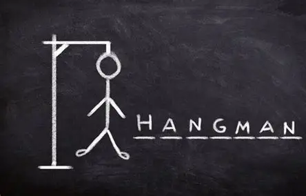

# 🎯 Python Hangman Game



A classic Hangman game implemented in Python with both console and GUI versions.

## ✨ Features

- **Two versions included**:
  - Console version (standard Python)
  - GUI version (Tkinter)
- Customizable word lists
- Visual hangman drawing progression
- Guess tracking (correct/wrong letters)
- Win/lose detection

## 🚀 Getting Started

### Requirements

- Python 3.7+ (3.11 recommended for best compatibility)
- For GUI version: Tkinter (usually included with Python)

### Installation

1. Clone the repository:
   ```bash
   git clone https://github.com/yourusername/hangman-game.git
   cd hangman-game
   ```
