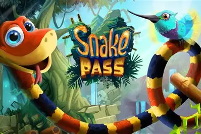

# 🐍 Python Snake Game



A complete implementation of the classic **Snake Game** using Python's Turtle graphics module.

---

## 📑 Table of Contents

- [✨ Features](#-features)
- [⚙️ Requirements](#-requirements)
- [📥 Installation](#-installation)
- [🎮 How to Play](#-how-to-play)
- [📁 Project Structure](#-project-structure)
- [💡 Code Overview](#-code-overview)
- [🚫 .gitignore](#-gitignore)
- [🎯 Controls](#-controls)
- [📝 License](#-license)

---

## ✨ Features

✅ Smooth 4-directional snake movement✅ Randomly generated food items✅ Real-time scoring system with high score persistence✅ Collision detection for:

- Walls
- Snake's own body
- Food
  ✅ High score saved between sessions

---

## ⚙️ Requirements

- Python **3.6+**
- **Turtle** module (pre-installed with Python standard library)

---

## 📥 Installation

```bash
# Clone the repository
git clone https://github.com/Muhannad7usam/PYTHON.git

# Navigate to the game directory
cd PYTHON/Snake-Game/

# Run the game
python main.py
```
