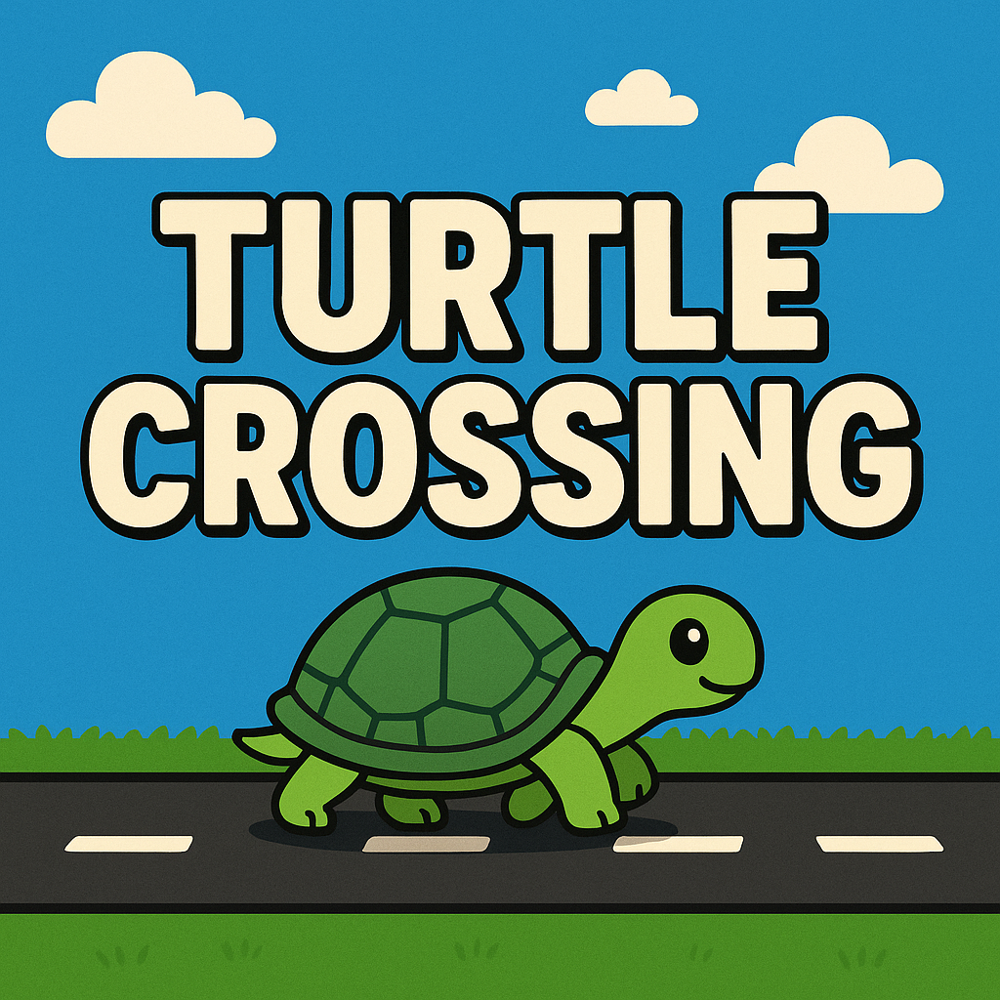

# Turtle Crossing Game

A Python game using Turtle graphics where the player controls a turtle trying to cross a busy road.



## Features

- Player controls a turtle with keyboard input
- Randomly generated cars with increasing difficulty
- Score tracking and level progression
- Game over detection

## How to Run

1. Ensure you have Python 3 installed
2. Clone this repository
3. Run the game:

```bash
python main.py
```
