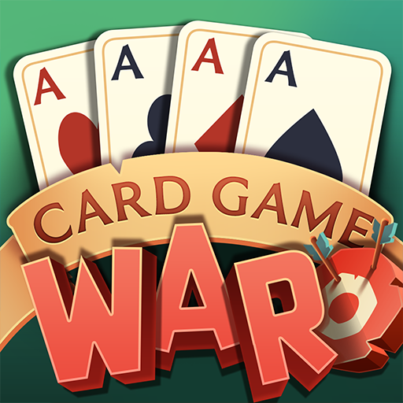

# War Card Game 🃏

A Python implementation of the classic War card game with console interface.



## Features

- Complete implementation of War card game rules
- Proper handling of war scenarios
- Score tracking
- Clean console interface
- Modular code structure

## Requirements

- Python 3.6+

## Installation

1. Clone the repository:

```bash
git clone https://github.com/Muhannad7usam/PYTHON.git
cd PYTHON/War-Card-Game
```
